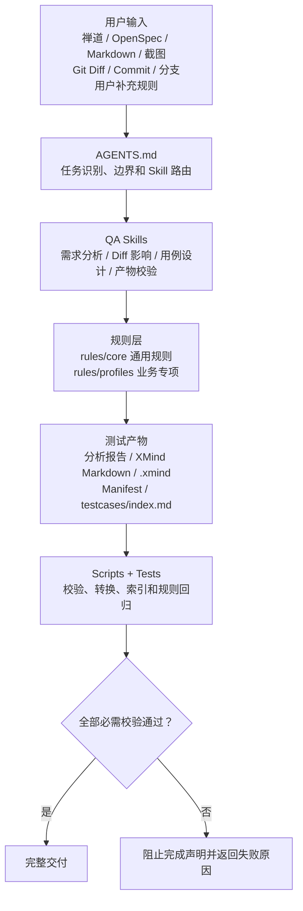
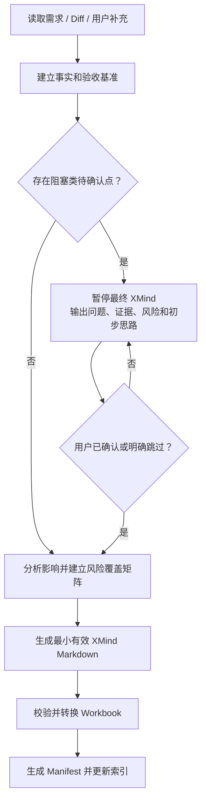

# Codex QA Agent Rules

## 目录导航

- [Skills](skills/README.md)：按任务类型执行的 QA 工作流。
- [Rules](rules/README.md)：核心规则、业务 Profile 与生成 Schema 的正式入口。
- [核心规则](rules/core/README.md)：跨场景的正式规则与仓库治理约束。
- [业务 Profiles](rules/profiles/README.md)：按业务场景补充的专项规则。
- [Schema 契约](rules/schemas/README.md)：由可执行契约生成的 JSON Schema。
- [Scripts](scripts/README.md)：离线生成、转换、索引和静态校验工具。
- [Tests](tests/README.md)：规则、脚本和契约的自动化测试。
- [Testcases](testcases/README.md)：可追踪的测试产物与 Manifest。
- [Codex 文档](docs/codex/README.md)：使用说明和发布检查清单。
- [QA Knowledge](qa-knowledge/README.md)：脱敏、可复用的业务知识示例。

## 版本与变更历史

当前版本只读取根目录 [RULE_VERSION](RULE_VERSION)。完整历史统一维护在 [CHANGELOG.md](CHANGELOG.md)；README 不单独维护版本号或复制完整版本历史。

接口自动化当前保留 `content.code=0`、`content.msg=OK` 参数健康检查；健康性断言 ≠ 业务数据断言。本阶段只支持 `assertion_scope=parameter_health`，不自动生成业务响应字段、指标、排序、数据库或跨系统一致性断言。

[](https://github.com/rainx23/codex-qa-agent-rules/actions/workflows/qa-rules-validation.yml)

`codex-qa-agent-rules` 是一套面向软件测试工作的 Codex QA 规则与 Skills 框架。它把需求分析、Diff 影响分析、风险识别、测试用例设计、XMind 产物生成、自动质量校验和测试产物治理串成一条可复用工作流。

当前规则版本以根目录 [RULE_VERSION](RULE_VERSION) 为唯一来源；Schema、Manifest、CI 和产物索引都校验该版本，禁止在多个脚本中分别维护版本号。

它支持禅道、OpenSpec、Markdown、截图、用户补充规则、Git Diff、Commit、分支和代码上下文，重点解决测试工作中常见的规则遗漏、无证据推断、重复用例、模糊预期、Diff 影响范围不完整和交付格式不统一。

> 这不是业务自动化测试框架，不是单纯的 XMind 转换工具，也不是默认修改业务代码的 Agent。它的本质是：测试分析规则 + QA Skills + 用例设计规范 + XMind 产物生成 + 自动质量校验 + 测试产物治理。

## 你可以得到什么

| 输入 | 能力 | 输出 |
| --- | --- | --- |
| 禅道、OpenSpec、Markdown、截图、用户补充 | 需求理解、规则拆解、待确认点和验收基准 | 需求分析报告、风险和回归范围 |
| Commit、Diff、分支、工作区变更 | 变更范围、调用链、需求覆盖和影响分析 | Diff 分析报告、疑似风险和测试点 |
| 已确认需求和风险 | 风险矩阵、去重和最小有效用例集 | 固定格式 XMind Markdown |
| 报告、Markdown、Workbook、Manifest | 自动校验、转换、复验和版本治理 | `.xmind`、Manifest、`testcases/index.md` |

第一次使用建议先阅读本 README，再看 [AGENTS.md](AGENTS.md) 和当前任务对应的 `SKILL.md`。

## 适用场景

- 禅道、OpenSpec、Markdown、文本需求和截图辅助分析。
- 单 Commit、Commit 范围、分支、工作区及暂存区 Diff 分析。
- 需求与代码 Diff 联动验收、公共逻辑和调用链影响分析。
- 测试点、最小有效用例集和 XMind 测试用例设计。
- P0/P1/P2 风险、证据状态和分层回归范围分析。
- Web、API、SQL 数据、金融交易、权限安全、导出和非功能需求。
- 分析报告、XMind Markdown、Workbook、Manifest 和历史索引验收。

## 不适用场景

- 默认不修改 SQL、Java、Groovy、前端、接口或其他业务实现。
- 不代替产品、业务和开发进行最终需求确认。
- 不在证据不足时虚构接口、字段、页面、权限、SQL 或业务预期。
- 不自动执行页面、接口、性能或压测任务。
- 不等同于 Playwright、Selenium、JMeter 等自动化执行框架。
- 不保证仅凭截图即可还原完整业务规则。

## 整体架构



规则优先级为：用户本轮明确要求 > [AGENTS.md](AGENTS.md) 全局边界 > 当前任务 Skill > [核心规则](rules/core/) > [业务 Profile](rules/profiles/) > 示例和模板。示例不能覆盖正式规则。

## 核心框架组成

### 1. 总入口：AGENTS.md

- **是什么**：Codex 进入项目后读取的总规则入口。
- **负责**：角色边界、任务路由、输出模式、全局门禁和规则优先级。
- **不负责**：保存每种任务的详细执行正文。
- **何时使用**：每次在本项目执行需求、Diff、用例或产物任务时。
- **主要文件**：[AGENTS.md](AGENTS.md)。

### 2. 工作流能力：Skills

- **是什么**：四个可独立触发、可组合执行的 QA 工作流。
- **负责**：规定每类任务需要读取哪些规则、执行哪些步骤、输出什么结果。
- **不负责**：复制核心规则全文或绕过证据和待确认门禁。
- **何时使用**：用户意图命中需求分析、Diff、用例设计或产物验收时。
- **主要目录**：[skills](skills/)。

### 3. 通用规则：rules/core

- **是什么**：所有通用 QA 规则的唯一正文来源。
- **负责**：证据、报告契约、待确认、追踪、用例质量和产物治理。
- **不负责**：保存某一业务领域的全部检查项。
- **何时使用**：由 Skills 按固定顺序读取。
- **主要目录**：[rules/core](rules/core/)。

### 4. 业务专项规则：rules/profiles

- **是什么**：按需求、Diff 或历史缺陷证据启用的专项风险清单。
- **负责**：补充 Web、API、SQL、金融、权限、非功能和禅道需求特有规则。
- **不负责**：把清单机械展开为大量测试用例。
- **何时使用**：输入证据命中对应业务类型时。
- **主要目录**：[rules/profiles](rules/profiles/)。

### 5. 自动工具：scripts

- **是什么**：基于 Python 标准库的确定性校验、转换和索引工具。
- **负责**：报告、Markdown、Workbook、Manifest、索引、编码和 Skill 契约校验。
- **不负责**：执行真实业务页面、接口或性能测试。
- **何时使用**：生成产物、发布规则或检查历史产物时。
- **主要目录**：[scripts](scripts/)。

### 6. 自动测试：tests

- **是什么**：规则、校验器、转换器和治理脚本的行为回归集。
- **负责**：验证有效样例通过、无效样例失败以及 Golden 输出保持稳定。
- **不负责**：替代业务项目自身的单元测试和自动化测试。
- **何时使用**：修改规则、Skill、脚本或发布新版本前。
- **主要目录**：[tests](tests/)。

### 7. 测试产物：testcases

- **是什么**：分析报告、XMind 用例、Workbook、Manifest 和历史索引的治理入口。
- **负责**：保存可追踪、可版本化的测试分析交付物。
- **不负责**：保存业务实现代码。
- **何时使用**：完整输出或需要管理历史版本时。
- **主要目录**：[testcases](testcases/)。

### 8. 兼容入口：docs/codex

- **是什么**：旧规则路径的兼容入口和发布验收清单。
- **负责**：把旧引用引导到 Skills 与 `rules` 的唯一正文。
- **不负责**：重新复制核心规则全文。
- **何时使用**：旧项目仍引用 `docs/codex`，或执行发布前验收时。
- **主要目录**：[docs/codex](docs/codex/)。

## 六个 QA Skills

| Skill | 触发场景 | 主要职责 | 主要输出 |
| --- | --- | --- | --- |
| [`qa-requirement-analysis`](skills/qa-requirement-analysis/SKILL.md) | 禅道、OpenSpec、Markdown、截图、需求评审 | 需求理解、事实拆解、待确认点、验收基准、风险和回归范围 | 需求分析结果 |
| [`qa-diff-impact-analysis`](skills/qa-diff-impact-analysis/SKILL.md) | Commit、Diff、分支、工作区变更 | 变更范围、调用链、需求覆盖、疑似风险和回归范围 | Diff 影响分析 |
| [`qa-testcase-design`](skills/qa-testcase-design/SKILL.md) | 测试点、测试用例、XMind、P0/P1/P2 | 风险矩阵、去重、最小有效用例集和固定格式输出 | XMind Markdown |
| [`qa-artifact-validation`](skills/qa-artifact-validation/SKILL.md) | 校验、转换、发布、索引 | 报告、Markdown、Workbook、Manifest 和索引校验 | 校验结果和最终产物 |
| [`qa-knowledge-management`](skills/qa-knowledge-management/SKILL.md) | 历史知识、DDL、指标、数据验证、SQL/REC | 检索、比较、草稿、确认后持久化和离线校验 | 知识快照、数据验证模型、SQL/REC 计划 |
| [`qa-api-automation`](skills/qa-api-automation/SKILL.md) | 接口自动化分析、新建和维护 | 提取 Groovy/SQL 参数与分支，生成 Excel 和参数文本 | API Automation Model、`.xlsx`、参数文本 |

### Skill 语言约定

Skill 的工作流说明、章节标题、边界和用户可见提示词统一使用中文；`description` 采用“中文场景说明 + 精简英文触发关键词”，以兼顾中文使用体验和英文路由兼容性。Skill 名称、目录名、YAML/JSON 字段、Schema、枚举、固定 ID、命令参数和文件路径属于机器标识，继续保持英文且不得翻译。

职责边界：需求 Skill 不直接渲染 XMind；Diff Skill 不凭代码行为定义业务预期；用例 Skill 不绕过待确认门禁；产物 Skill 不修改业务规则来让校验通过。

## 核心规则

`rules/core` 中的通用规则只能维护一份，Skills 和兼容文档只引用，不复制完整正文。

| 文件 | 作用 |
| --- | --- |
| [evidence-rules.md](rules/core/evidence-rules.md) | 证据来源、事实分类和禁止编造 |
| [confirmation-gate.md](rules/core/confirmation-gate.md) | 阻塞、非阻塞、建议确认的判断机制 |
| [analysis-report-contract.md](rules/core/analysis-report-contract.md) | 纯需求、纯 Diff、联动分析报告契约 |
| [testcase-quality-rules.md](rules/core/testcase-quality-rules.md) | 用例质量、去重、模糊断言和固定 XMind 格式 |
| [traceability-rules.md](rules/core/traceability-rules.md) | 需求、Diff、风险和测试点追踪 |
| [artifact-governance-rules.md](rules/core/artifact-governance-rules.md) | 报告、XMind、Manifest 和索引治理 |
| [sql-coding-standards.md](rules/core/sql-coding-standards.md) | 验证 SQL 唯一编写规范和安全边界 |
| [structured-model-contract.md](rules/core/structured-model-contract.md) | 四个 Skills 的结构化交接模型、生命周期和 Schema 生成规则 |
| [api-automation-rules.md](rules/core/api-automation-rules.md) | 接口自动化影响、参数化、固定 Excel 和健康校验规则 |

四个 Skills 通过 Requirement Analysis、Diff Impact、Risk Coverage Matrix、Testcase Model 依次交接。Python 契约定义在 [qa_contracts.py](scripts/qa_contracts.py)，`rules/schemas/*.schema.json` 是生成产物，不是第二份手工维护的规则正文。

## 业务 Profiles

Profile 是业务类型专项检查清单。只有需求、Diff、代码或历史缺陷命中时才启用，其中的检查项不能机械转换成测试用例。

| Profile | 适用内容 |
| --- | --- |
| [web-ui.md](rules/profiles/web-ui.md) | 查询、列表、字段、个性化配置、弹窗、下钻和导出 |
| [api.md](rules/profiles/api.md) | 接口契约、请求响应、幂等、重试和调用链 |
| [sql-data.md](rules/profiles/sql-data.md) | SQL、关联、聚合、精度、迁移和回填 |
| [finance-trading.md](rules/profiles/finance-trading.md) | 金额、持仓、交易、策略、行情和审计 |
| [permission-security.md](rules/profiles/permission-security.md) | 权限、数据隔离、越权和敏感数据 |
| [nonfunctional.md](rules/profiles/nonfunctional.md) | 并发、一致性、韧性、可观测性和性能 |
| [zentao.md](rules/profiles/zentao.md) | 禅道章节识别、第三部分优先和需求证据层级 |
| [api-automation-groovy-sql.md](rules/profiles/api-automation-groovy-sql.md) | Groovy/SQL 参数和有效分支提取 |

## 从需求到 XMind 的完整工作流

1. 读取需求、Diff 和用户补充证据。
2. 明确本次分析范围和不在范围。
3. 建立确定事实、冲突事实、推断事实和缺失事实。
4. 判断是否存在阻塞类待确认点。
5. 从需求中建立可追踪的验收基准。
6. 分析 Diff、公共逻辑、直接及间接调用链。
7. 逐行建立需求证据、Diff 变更、覆盖状态、风险 ID 和 TC 的追踪矩阵。
8. 去重并生成最小有效测试用例集。
9. 渲染固定格式 XMind Markdown。
10. 校验分析报告和 Markdown。
11. 转换为 `.xmind` Workbook。
12. 复验 Workbook 中的根节点、TC 数和总节点数。
13. 生成并校验 Manifest。
14. 原子更新 `testcases/index.md`。

追踪关系必须来自正式 Markdown 表格行，TC 仅出现在普通正文、使用 `TC001-TC010` 范围或缺少风险/证据的文本，都不视为已建立追踪。



只有阻塞类问题暂停最终用例；非阻塞类和建议确认类可以继续已明确部分。用户跳过的问题仍需保留，假设不能升级为事实。

## 分析报告模式

正式章节契约见 [analysis-report-contract.md](rules/core/analysis-report-contract.md)。报告可写明 `报告模式`，也可由校验器兼容自动识别。

| 模式 | 典型输入 | 必需章节 | 不强制内容 |
| --- | --- | --- | --- |
| 纯需求 `requirement` | 禅道、OpenSpec、Markdown、截图、粘贴需求 | 本次分析范围、需求理解、规则拆解、证据来源、待确认点、风险点、测试点摘要、回归范围 | 疑似缺陷、追踪矩阵 |
| 纯 Diff `diff` | Commit、范围、分支、工作区或暂存区 | 本次分析范围、Commit/Diff 对比范围、Diff 涉及文件、核心改动点、证据来源、待确认点、疑似风险点、疑似缺陷、测试点摘要、回归范围 | 无需求基准时不要求追踪矩阵 |
| 联动 `combined` | 需求和 Diff 同时存在 | 本次分析范围、需求理解、Diff 理解、证据来源、待确认点、风险点、疑似缺陷、测试点摘要、回归范围、追踪矩阵 | 无 |

联动报告先提取需求验收基准，再检查实现是否覆盖、遗漏或偏离需求。只有需求证据和 Diff 证据充分，且记录证据状态和影响时，才称为疑似缺陷。

模式识别顺序：命令行 `--mode` > 报告中的 `报告模式` 字段 > 标准化章节和证据自动识别。标题支持中文数字、阿拉伯数字、括号、顿号、中英文句号和空格编号。

## 禅道需求如何分析

第一部分“需求背景”主要用于理解业务目标、用户痛点和为什么需要改动；第三部分“产品实现方案、规则”通常是页面、字段、条件、数据、排序、状态和验收口径的主要确定性依据。

证据优先级：用户本轮明确确认 > 第三部分产品实现方案、规则 > 明确验收标准和数据口径 > 其他产品方案补充 > 第一部分需求背景 > 截图 > 当前代码实现。

- 第一部分和第三部分只有普通描述差异时，默认以第三部分验收，不机械阻塞。
- 第三部分可能无法达到第一部分核心目标时，记录“业务目标偏差风险”。
- 第三部分内部出现相反规则、与用户确认冲突或缺失会产生相反预期时，进入冲突事实和阻塞类待确认。
- 没有第三部分时，先查找验收标准或其他明确产品规则；不得假装已读取第三部分。
- 用户明确指定分析第一部分、截图或补充说明时，优先遵守本轮范围，并在报告标明主要依据和未分析范围。

详细规则见 [zentao.md](rules/profiles/zentao.md)。

## 固定 XMind Markdown 格式

有公共入口或公共业务对象：

```text
- 业务根节点
    - 功能测试
        - 公共入口或业务对象
            - TC001
                - 业务测试点
                    - 操作步骤
                        - 预期结果
```

没有公共入口：

```text
- 业务根节点
    - 功能测试
        - TC001
            - 一级业务模块
                - 二级功能点
                    - 操作步骤
                        - 预期结果
```

同一核心规则覆盖多个真实测试入口时仍只保留一个 TC，但入口必须拆成独立平级分支。公共入口结构为 `TC → 测试点 → 具体入口 → 步骤 → 预期`；无公共入口结构为 `TC → 一级业务模块 → 二级功能点 → 具体入口 → 步骤 → 预期`。单入口继续使用原有四层/五层结构，不增加无意义的入口层；每个多入口分支都必须有自己的步骤和预期，禁止直接步骤与入口分支混用或把“分别打开/依次进入多个入口”写在同一行。入口必须是真实业务名称，不得使用“入口A”“页面1”等占位符。仅当数据来源、权限、条件、预期、异常处理、风险或失败定位不同才拆分为多个 TC。

关键约束：TC 必须严格匹配 `TC` 加三位数字并从 `TC001` 全局连续；缩进固定为 4 个空格；本地文件不使用代码块；相同规则的页面、字段或弹窗优先合并；模糊断言会被拒绝；不得虚构字段、SQL 和页面入口。明确的状态值或状态转换可以包含“正常”，泛化的“页面正常/功能正常”仍会失败。排序属于“功能测试”，不单独建立“排序测试”一级维度。

完整规则见 [testcase-quality-rules.md](rules/core/testcase-quality-rules.md)。当前格式不增加独立“前置条件”或“优先级”层级，前置条件融入入口、测试点或步骤，优先级保留在分析报告和追踪矩阵中；`entry_branches` 只表达同一 TC 的入口分支，不增加 TC 或 Manifest 计数。

## 历史业务知识与数据验证

需求、Diff、用例和验证 SQL 生成前，`qa-knowledge-management` 会按业务域、表、字段、逻辑、指标和需求 ID 检索命中的 active 知识。公共规则仓库只提供脱敏的 [`qa-knowledge/examples`](qa-knowledge/examples)；集成项目把真实知识放在项目自己的 `qa-knowledge/`，不会把全部历史文件一次性加载。

用户可以直接在 Chat/Codex 粘贴一张或多张完整 `create table` DDL，也可以只提供少量字段。`parse_chat_ddl.py` 只做离线识别、拆分、哈希和结构化草稿：完整 DDL 进入 `current.sql`/`metadata.json`，局部字段标记 `schema_scope=partial`，不补齐字段、不覆盖 complete DDL。相同规范化哈希只增加引用；结构变化由 `compare_ddl.py` 输出差异，旧版本移入 history，正式持久化必须经过用户确认。

数据影响结论使用 `required`、`optional`、`not_required`、`blocked`，方式使用 `sql`、`cross_source_reconciliation`、`mixed`、`not_applicable`、`blocked`。新增字段、指标/口径、数据源、过滤、关联、聚合、时间、权限或历史兼容变化默认需要数据验证；纯样式和文案可标记 `not_required`。指标准确性默认必须生成 SQL，因为两个页面可能共享同一错误数据源。只有用户或明确验收文档提供基准入口、对比字段、过滤、时间和容忍度时，才允许 `cross_source_reconciliation`；系统不会根据入口名称或代码自行猜测 B/C 可以对数。

验证 SQL 独立保存并使用 `SQLV001` 等 ID，直接对数方案使用 `REC001` 等 ID，XMind 只引用 ID，不嵌入大段 SQL。SQL 最多到 `generated/reviewed`，没有用户执行结果不得标记 `executed/passed/failed`。唯一 SQL 规范见 [`sql-coding-standards.md`](rules/core/sql-coding-standards.md)，静态检查禁止数据库连接、SQL 执行、DML、危险 DDL 和凭据。

常用命令：

```bash
python scripts/parse_chat_ddl.py pasted.txt -o draft.json
python scripts/compare_ddl.py old.sql new.sql
python scripts/validate_knowledge.py qa-knowledge/examples
python scripts/build_knowledge_index.py qa-knowledge/examples --check
python scripts/search_knowledge.py qa-knowledge/examples --table demo.orders
python scripts/validate_data_validation.py path/to/data-validation-model.json
python scripts/validate_sql_style.py path/to/validation_sql.sql --strict
python scripts/validate_sql_artifact.py path/to/validation-sql-manifest.json
```

## 测试产物

| 产物 | 用途 |
| --- | --- |
| 分析报告 | 记录需求、Diff、证据、待确认、风险、测试点和回归范围 |
| XMind Markdown | 可审阅、可 Diff、可版本管理的主要用例源文件 |
| `.xmind` Workbook | Markdown 校验通过后生成、可由 XMind 打开的交付文件 |
| 数据验证模型 / SQL / REC 计划 | 独立记录数据验证决策、只读 SQL 和直接对数关系，不嵌入 XMind |
| Manifest | 记录来源哈希、规则版本、时区、待确认/P0 计数、安全路径、状态和版本关系 |
| `testcases/index.md` | 分离管理校验状态、产物关系和旧业务状态；旧行显式标记“未按当前规则校验/未迁移” |

Markdown 是主要用例源文件，`.xmind` 是转换后的交付文件。转换或 Workbook 复验失败时，不能宣称完整产物已经生成。

## 快速开始

### 1. 环境要求

- Python 3.10 或更高版本。
- Codex。
- Git。
- XMind：可选，仅用于人工打开 Workbook。

运行时脚本只使用 Python 标准库，不要求安装额外第三方依赖。

### 2. 克隆并进入仓库

```bash
git clone https://github.com/rainx23/codex-qa-agent-rules.git
cd codex-qa-agent-rules
```

### 3. 执行规则检查

```bash
python scripts/validate_skill_contracts.py skills
python scripts/generate_schemas.py --check
python scripts/validate_schemas.py
python scripts/validate_rule_version.py
python scripts/validate_repository_mode.py
python -m unittest discover -s tests -v
```

输入是当前 Skills、规则、脚本和 Fixtures；成功时输出 `PASS` 或测试 `OK`；失败表示 Skill 契约、规则行为或 Golden 输出发生回退。

### 4. 校验分析报告

```bash
python scripts/validate_analysis_report.py path/to/requirement_report.md --mode requirement
python scripts/validate_analysis_report.py path/to/diff_report.md --mode diff
python scripts/validate_analysis_report.py path/to/combined_report.md --mode combined
python scripts/validate_analysis_report.py path/to/report.md --mode auto
```

输入是 Markdown 分析报告；成功时输出报告路径和识别模式；失败会列出缺少章节、证据、追踪、疑似缺陷或 P0 映射问题。`auto` 优先读取报告中的显式模式，再按章节结构识别。

如需同时核对报告引用的 TC：

```bash
python scripts/validate_analysis_report.py path/to/report.md --mode combined --xmind-md path/to/case_xmind.md
python scripts/validate_traceability.py path/to/report.md path/to/case_xmind.md --mode combined \
  --risk-matrix path/to/risk-coverage-matrix.json --testcase-model path/to/testcase-model.json
```

### 5. 校验 XMind Markdown

```bash
python scripts/validate_xmind_md.py path/to/case_xmind.md
python scripts/validate_xmind_md.py path/to/case_xmind.md --strict
```

输入是用例 Markdown；成功时输出 TC 数；失败表示根节点、维度、层级、编号、断言或去重规则不满足要求。

### 6. 转换为 XMind

```bash
python scripts/md_to_xmind.py path/to/case_xmind.md --strict
```

输入是校验通过且文件名包含 `_xmind` 的 Markdown；成功后生成 `_workbook` `.xmind` 并复验压缩包；失败时不会把不完整 Workbook 宣称为成功。已有目标文件默认不会覆盖。

### 7. 校验 Manifest

```bash
python scripts/validate_manifest.py path/to/manifest.json
```

输入是 Manifest；成功表示字段、计数、路径、状态、版本关系和已完成产物一致；失败时不能更新索引或声明完整交付。

### 8. 更新索引

```bash
python scripts/build_testcase_index.py testcases/index.md path/to/manifest.json
```

输入是目标索引和已通过校验的 Manifest；成功后原子写入一条唯一 `artifact_id` 记录；无效 Manifest 会阻止更新。

### 9. 发布前检查

```bash
python -m compileall -q scripts tests
python scripts/validate_skill_contracts.py skills
python scripts/generate_schemas.py --check
python scripts/validate_schemas.py
python scripts/validate_rule_version.py
python scripts/validate_repository_mode.py
python scripts/validate_ci_workflow.py
python -m unittest discover -s tests -v
python scripts/validate_manifest.py testcases/manifest.example.json
python scripts/repair_text_encoding.py testcases/index.md --check
```

完整清单见 [rule-validation-checklist.md](docs/codex/rule-validation-checklist.md)。

## Codex 使用示例

需求分析：

```text
请使用 qa-requirement-analysis 分析该禅道需求，优先分析第三部分产品实现方案和规则，输出需求理解、待确认点、风险和回归范围。
```

Diff 分析：

```text
请使用 qa-diff-impact-analysis 分析当前 Commit 与父提交的差异，重点检查接口、SQL、公共逻辑、调用链和已有自动化测试影响。
```

生成完整测试用例：

```text
请基于已经确认的需求分析结果，使用 qa-testcase-design 生成最小有效 XMind Markdown 测试用例，按固定格式输出并去除重复用例。
```

完整输出：

```text
请完成需求分析、Diff 影响分析、测试用例设计和产物校验，生成分析报告、XMind Markdown、.xmind、Manifest，并更新测试产物索引。
```

只列 P0：

```text
请只生成 P0 核心链路和关键数据风险测试用例，不生成 P1、P2。
```

## 目录结构

```text
codex-qa-agent-rules/
├── AGENTS.md
├── README.md
├── RULE_VERSION
├── CHANGELOG.md
├── rules-repository.json
├── .github/workflows/
├── skills/README.md
├── rules/
│   ├── README.md
│   ├── core/README.md
│   ├── profiles/README.md
│   └── schemas/README.md
├── scripts/README.md
├── tests/README.md
├── testcases/README.md
├── docs/codex/README.md
└── qa-knowledge/README.md
```

## 推荐阅读顺序

1. `README.md`：理解用途、架构和使用入口。
2. `AGENTS.md`：了解全局边界和任务路由。
3. 当前任务对应的 `SKILL.md`：了解具体工作流。
4. `rules/core`：查阅通用正式规则。
5. 命中的 `rules/profiles`：查阅专项风险。
6. `scripts`：了解可执行质量门禁。
7. `tests`：了解规则的通过和失败行为。
8. `testcases`：了解产物和版本治理。

不同角色的最短路径：

- 普通使用者：README → AGENTS → 对应 Skill。
- 规则维护者：README → `rules/core` → `rules/profiles` → `tests`。
- 脚本维护者：`scripts` → `tests` → `artifact-governance-rules.md`。

## 如何接入其他项目

### 独立规则仓库模式

本仓库可独立维护，用于规则开发、测试和版本发布，不要求存在嵌套的 `codex-qa-agent-rules` 目录。`rules-repository.json` 必须显式配置 `"mode": "standalone"`，执行命令时以仓库根目录为工作目录。

### 业务项目集成模式

将 `AGENTS.md`、`skills/`、`rules/`、`scripts/`、`docs/codex/` 和对应测试同步到业务项目，或由项目现有机制引用这些目录。本仓库不提供未实现的自动安装器。外层项目的 `rules-repository.json` 必须显式配置 `"mode": "integrated"` 和 `template_path`；校验器会检查镜像资产，不再根据目录是否存在进行模糊跳过。

- 规则默认不得修改业务代码目录。
- 各业务项目可以独立维护历史 `testcases` 和索引行。
- `AGENTS.md`、规则、Skills、脚本和测试应保持版本一致。
- 使用 Manifest 的 `rule_version` 追踪生成产物所使用的规则版本。

当前外层业务项目和模板仓库并存时，同名规则文件必须同步；历史索引内容可以按项目实际产物保留差异。

## 如何扩展框架

新增一级功能目录时必须新增该目录 README；新增复杂二级模块时评估是否需要 README。修改目录职责或主要入口时，必须同步更新受影响目录 README，并按 [仓库目录与版本历史治理规则](rules/core/repository-documentation-rules.md) 判断是否更新根 README、CHANGELOG 和 RULE_VERSION。

### 新增 Profile

1. 在 `rules/profiles` 新增领域文件。
2. 只写领域特有风险，不复制 `rules/core`。
3. 在相关 Skill 中增加按证据命中的路由。
4. 增加有效和无效行为测试。
5. 更新本 README 的 Profile 表格。

### 新增 Skill

1. 创建 `skills/<skill-name>/SKILL.md`。
2. 添加只包含 `name` 和 `description` 的合法 frontmatter。
3. 创建并校验 `agents/openai.yaml`。
4. 引用核心规则，明确输入、执行步骤、输出和禁止事项。
5. 增加 Skill 契约测试并更新 `AGENTS.md` 路由。

### 修改核心规则

- 一条通用规则只维护一份。
- 修改规则时同步修改校验器和行为测试。
- 执行完整发布验收清单。
- 不允许只改文档但保留不一致的脚本行为，也不允许新增脚本却不接入规则和测试。

## 质量门禁

| 校验对象 | 主要校验内容 |
| --- | --- |
| Skill | frontmatter、目录名、引用路径和 Agent 配置 |
| 分析报告 | 报告模式、编号章节、证据、追踪矩阵、疑似缺陷和 P0 映射 |
| XMind Markdown | 单根、固定维度、层级、编号、模糊断言和重复用例 |
| Workbook | 必需 JSON 文件、根节点、TC 数和节点数 |
| Manifest | 必填字段、计数、路径、状态和版本关系 |
| 索引 | UTF-8 编码、`artifact_id` 唯一性和原子更新 |
| 规则仓库 | Python 语法、单元测试、Golden Case、引用和双目录同步 |
| CI | Python 3.10/3.12、Schema 生成漂移、仓库模式、完整测试和临时 Workbook 转换 |

任何必需校验失败时，都不能宣称产物已经完整生成。

## FAQ

### 1. 这个项目会自动修改业务代码吗？

默认不会。只有用户明确授权修改或修复业务代码时才允许进入相应范围。

### 2. 它会自动执行测试吗？

不会。它负责分析、用例设计和产物校验，不等同于 UI、接口或性能自动化执行框架。

### 3. 为什么存在待确认点时有时还能继续生成用例？

只有阻塞类待确认点暂停最终用例；非阻塞类和建议确认类可以继续生成已经明确的部分。

### 4. 为什么不允许使用“功能正常”作为预期？

因为该表达不能形成明确、可观察、可复现的测试判定。

### 5. 为什么相同弹窗可能被合并成一条用例？

项目采用最小有效用例集；规则、数据来源、步骤、预期和风险相同时优先合并。

### 6. 为什么 Markdown 和 `.xmind` 都要保留？

Markdown 便于审阅、Diff 和版本管理，`.xmind` 用于查看和交付。

### 7. 排序测试放在哪里？

排序属于“功能测试”，不单独建立一级维度。

### 8. 禅道需求为什么优先看第三部分？

第一部分主要描述业务背景和目标，第三部分通常记录最终产品实现和验收规则。

### 9. 没有第三部分怎么办？

先查找验收标准、数据口径或其他明确产品方案；核心预期仍无法确定时列为阻塞类待确认。

### 10. 如何确认规则修改没有造成回退？

运行 [发布验收清单](docs/codex/rule-validation-checklist.md) 和全部单元测试，并确认规则副本同步。
